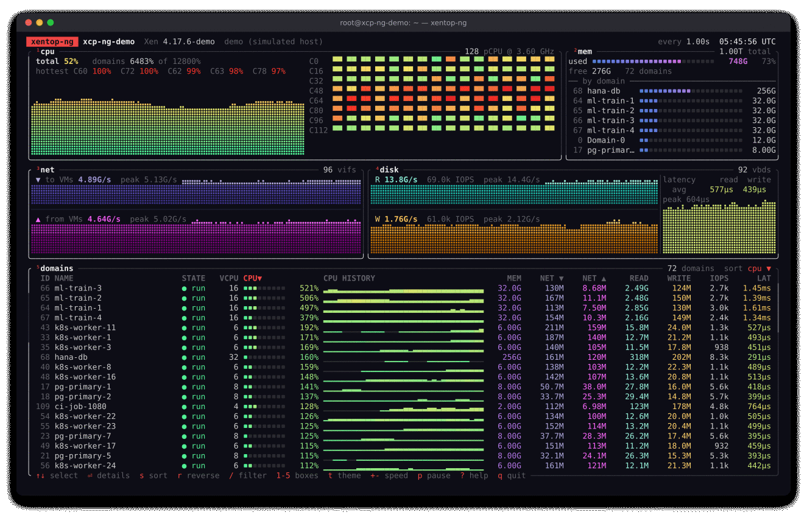
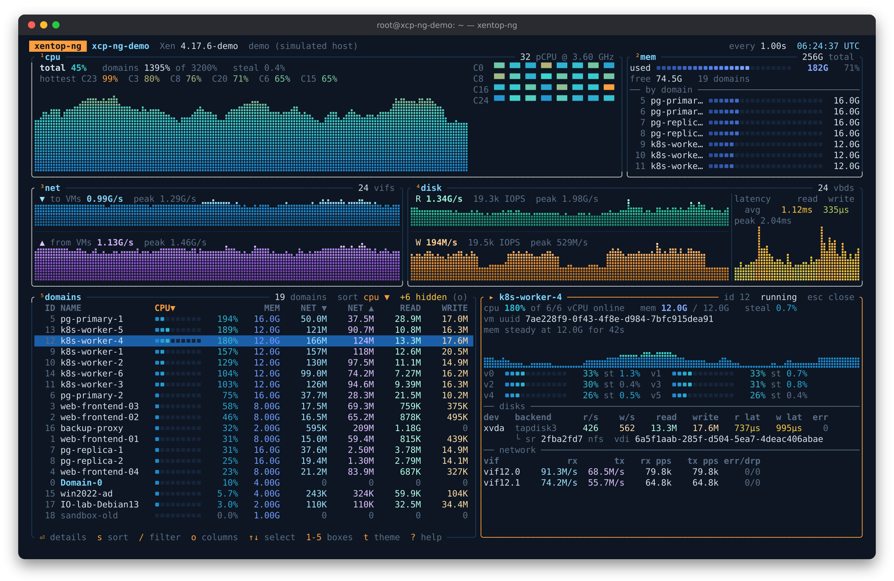

# xentop-ng

[](https://github.com/olivierlambert/xentop-ng/actions/workflows/ci.yml)

A modern, btop-inspired resource monitor for the Xen hypervisor.



<sub>Simulated 128-pCPU, 1 TiB host (`--demo-cpus 128 --demo-mem 1T`).
[Full-size screenshot](docs/xentop-ng.png).</sub>

`xentop` shows cumulative counters in a fixed ncurses table. xentop-ng shows
what is happening **now**: rates per interval, history graphs, per-pCPU load,
and disk latency. Point it at a domain and it breaks usage down per vCPU,
per disk and per network interface.

> **Status: demonstrator.** It runs on real XCP-ng 8.3 hosts. The interface
> and the libxenstat additions may still change before anything goes
> upstream.

## Features

- **CPU**: host load history. Per-pCPU mini graphs, switching to a heatmap
  on large hosts (128, 256, 1024+ pCPUs) with the hottest cores called out.
- **Memory**: host usage, plus the biggest domains.
- **Network and disk**: throughput graphs for traffic to/from VMs and for
  reads/writes, with IOPS and peaks.
- **Disk latency**: read/write service time from tapdisk3, with history.
- **Domain list**: sortable and filterable, with CPU meter, CPU history,
  memory, network, disk throughput, IOPS and latency. Columns adapt to the
  terminal width.
- **Domain details** (`⏎`): per-vCPU load, per-disk IOPS/throughput/latency,
  per-vif traffic, packets and errors. On XCP-ng: the VM UUID, each disk's
  SR and VDI, and the balloon target when it differs from current memory.
- **Storage repositories** (`v`): the disk box switches to per-SR totals
  (IOPS, throughput, read/write latency, the VM doing most of the I/O) and
  the busiest disks. Answers "which SR is slow, and who is hammering it".
  On other Xen hosts, disks are grouped by the directory or volume group
  that holds them.
- **Themes**: `btop`, `xcp-ng`, `dracula`, `gruvbox`.
- **Domains only**: `5` (or `--domains-only`) hides every other box; `5`
  again brings them back.
- **Mouse**: click to select, double-click for details, wheel to scroll.
- **Batch mode**: one JSON object per interval, for scripts and benchmarks.
- **Demo mode**: a simulated host of any size, no Xen needed.



## Try it: demo mode

No hypervisor needed:

```sh
cargo run --release -- --demo
```

The simulated host has a realistic fleet: web frontends, Postgres
primaries/replicas, Kubernetes workers, a domain controller, a backup proxy.
CI jobs come and go. Graphs start with ten minutes of history already filled
in. The fleet scales with the host you ask for:

| Option | Meaning | Default |
|---|---|---|
| `--demo-cpus N` | physical CPUs | 16 |
| `--demo-mem SIZE` | RAM (`512G`, `1T`, `1.5T`…) | 128G |
| `--demo-load PCT` | average host CPU load to aim for | 55 |
| `--demo-mem-use PCT` | share of RAM assigned to VMs | 80 |
| `--demo-stock` | behave like a stock libxenstat with no fallbacks | off |

Any `--demo-*` option implies `--demo`.

- **VM counts** follow the pCPU count.
- **VM sizes** follow the RAM.
- **Load** is calibrated at startup so the host averages the requested
  figure.
- **Big hosts** get extra workloads: ML training VMs from 64 pCPUs, and a
  256 GiB database VM per TiB of RAM from 512 GiB up.

```sh
xentop-ng --demo-cpus 128 --demo-mem 1T                  # the tour above
xentop-ng --demo-cpus 256 --demo-mem 2T --demo-load 85   # a busy large host
xentop-ng --demo-cpus 4 --demo-mem 16G                   # a small lab box
xentop-ng --demo-cpus 1024 --demo-mem 8T                 # stress the heatmap
```

## Install

Download from [Releases](https://github.com/olivierlambert/xentop-ng/releases):

- **XCP-ng 8.3:** `xentop-ng-<version>-xcp-ng-8.3.tar.gz`
  ```sh
  grep xcp-ng-8.3 SHA256SUMS | sha256sum -c -   # optional
  tar xzf xentop-ng-*-xcp-ng-8.3.tar.gz && cd xentop-ng-*-xcp-ng-8.3
  ./install.sh                                  # as root; installs to /opt/xentop-ng only
  /opt/xentop-ng/bin/xtop
  ```
  The bundle includes our patched libxenstat. Only the `xtop` launcher uses
  it; the system `xentop` and libxenstat stay untouched.
- **Any other x86_64 Linux dom0** (glibc 2.17 or newer):
  `xentop-ng-<version>-x86_64-linux-gnu.tar.gz` contains the binary. It uses
  the system libxenstat, with built-in fallbacks for the gaps (below).

Release archives come with `SHA256SUMS` and GitHub build provenance
attestations (`gh attestation verify <file> --repo olivierlambert/xentop-ng`).

## Running on a Xen host

xentop-ng runs in dom0 as root, like `xentop`. It loads **libxenstat at
runtime** rather than linking it, so one binary works with any Xen release.

It prefers a library found through `LD_LIBRARY_PATH`, so a patched copy can
sit next to the system one without replacing it. `--lib PATH` forces a
specific library. When running as root, that file and every directory above
it must be root-owned and not group/world-writable.

### Stock libxenstat, fallbacks, and our patches

Until [our libxenstat patches](libxenstat/) are upstream, xentop-ng collects
whatever the loaded libxenstat lacks by itself:

| Data | stock libxenstat | xentop-ng fallback | with our patches |
|---|---|---|---|
| Domains, vCPUs, memory, disk and network throughput/IOPS | ✓ | | ✓ |
| Per-pCPU load and heatmap | – | ✓ via libxenctrl `xc_getcpuinfo()` | ✓ |
| Disk latency (tapdisk3 VBDs) | – | ✓ reads tapdisk3's stats in `/dev/shm` | ✓ |
| Network on Open vSwitch hosts (XCP-ng default) | ✗ every VIF lost ([bug](libxenstat/README.md#0002-vifs-missing-on-open-vswitch-hosts)) | ✓ from `/proc/net/dev` | ✓ |
| VM UUID, balloon target, disk → SR/VDI (or backing path) | – | ✓ from xenstore | ✓ from xenstore |

Storage mapping never comes from libxenstat. xentop-ng reads it from
xenstore through `libxenstore.so` (also loaded at runtime): each domain's
`vm` and `memory/target` nodes, and each disk's backend `params`, e.g.
`/dev/sm/backend/<sr>/<vdi>` on XCP-ng. The SR type (ext, nfs, lvm...) comes
from where `/dev/sm/phy/<sr>/<vdi>` points and `/proc/mounts`. SR and VDI
*names* live in xapi only, so the UI shows UUIDs (the first block in
tables, in full in the details and in `--batch`).

When something is filled in by a fallback or missing altogether, the header
shows a discreet **◐** marker. Press **`i`** for the data sources panel,
which says where each metric comes from. `--batch` output includes the same
information under `"sources"`.

Missing values show as `-`, never a made-up number. blkback and qdisk disks
have no latency counters at all. Without per-pCPU data, host CPU is
estimated from domain CPU time and labelled `est.`.

### Building for XCP-ng 8.3 yourself

The scripts in [`build/`](build/) do everything inside the
`ghcr.io/xcp-ng/xcp-ng-build-env:8.3` container, pinned by digest, so the
output runs on the host's glibc 2.17. Every input is pinned: the Xen tag
(checked against its commit), the XCP-ng patch queue commit, the Rust
toolchain (`rust-toolchain.toml`) and rustup-init (by checksum).

```sh
build/build-libxenstat.sh     # patched libxenstat.so.4.17 (XCP-ng 4.17.6 + our patches)
build/build-xentop-ng.sh      # xentop-ng binary
build/deploy.sh HOST          # installs to /opt/xentop-ng on HOST over ssh, nothing else touched
dist/package.sh v0.1.0        # or: release archives in build/out/release/
```

### Security notes

- xentop-ng only **reads** statistics. It doesn't start, stop or change
  domains.
- **VM names** can be set by toolstack users who are less privileged than
  dom0 root. They are sanitised: control characters, bidi overrides and
  invisible characters are replaced. Wide characters are laid out by display
  width, and the side lists show domain IDs, so a VM named "Domain-0" can't
  pass for the real one.
- **Fallback files:** stats files in world-writable `/dev/shm` are only
  trusted if they and their directory are root-owned, opened without
  following symlinks, and belong to a live tapdisk.
- **xenstore values** (backing paths, VM paths) are length-bounded and
  sanitised like names. UUIDs are validated before they are used to build
  any path, so a crafted value can't point xentop-ng elsewhere.
- **sudo:** don't grant xentop-ng to other users through `sudo`. If you do
  anyway, `--lib` only accepts root-owned files in root-owned directories.

Please report vulnerabilities privately; see [SECURITY.md](SECURITY.md).

## Keys

| Key | Action |
|---|---|
| `↑` `↓` / `j` `k`, `PgUp` `PgDn`, `g` `G` | select domain |
| `⏎`, `space`, double-click | domain details |
| `s` `S` / `←` `→` | next / previous sort column |
| `c` `m` `n` `d` `l` | sort by cpu, memory, network, disk, latency |
| `r` | reverse sort |
| `0` | pin Domain-0 on top |
| `/` or `f` | filter by name, id or VM UUID prefix |
| `1` `2` `3` `4` | toggle cpu / mem / net / disk boxes |
| `5` | domains only; press again to bring the boxes back (`--domains-only` starts that way) |
| `v` | disk box: throughput graphs or per-SR totals and busiest disks |
| `+` `-` | slower / faster refresh |
| `p` | pause |
| `t` `T` | cycle themes |
| `i` | data sources: what libxenstat provides, what comes from fallbacks |
| `?` | help |
| `q` | quit |

## Other options

- `--colors 256`: for terminals without 24-bit colour. This is the default
  on the Linux console.
- `--theme NAME`: start with a given theme.
- `-d SECS`: refresh interval.

## Batch mode

```sh
xentop-ng --batch -d 1 -n 60 > run.jsonl
```

Each line is a JSON object with host and per-domain rates: CPU %, per-vCPU %,
network B/s and pps, disk B/s, IOPS and latency, per VBD and per VIF. This is
handy next to a benchmark run. Domains carry `vm_uuid` and `mem_target`
(bytes), VBDs `sr`, `vdi`, `sr_kind` and `path`, and `srs` holds the per-SR
totals (full UUIDs, latency, top VM by IOPS). Unknown values are `null`.

## Layout

```
src/
  source/xenstat.rs   libxenstat binding (dlopen, optional extended symbols)
  source/fallback.rs  collectors for what the loaded libxenstat lacks
  source/xenstore.rs  VM UUIDs, balloon targets, VBD → SR/VDI from xenstore
  source/demo.rs      simulated host
  model.rs            raw counters → per-interval rates
  history.rs          ring buffers behind the graphs
  ui/                 layout, boxes, braille graphs, meters, heatmap
libxenstat/           libxenstat patches: XCP-ng 4.17 and upstream versions
build/                container builds for XCP-ng and deploy script
dist/                 release packaging and the XCP-ng installer
.github/workflows/    CI (fmt, clippy, tests, MSRV, cargo-deny, shellcheck) and releases
docs/                 screenshots and the tools that generate them
```

Screenshots and the animated tour are generated from the demo, so they can
be refreshed after any UI change:

```sh
docs/tools/screenshot.sh docs/xentop-ng.png 200x56 "" -- --demo-cpus 128 --demo-mem 1T
docs/tools/screenshot.sh docs/detail.png 160x46 "j j j Enter" -- --demo-cpus 32 --demo-mem 256G --theme xcp-ng
docs/tools/record.sh docs/xentop-ng.gif 160x45 docs/tools/tour.steps -- --demo-cpus 128 --demo-mem 1T
```

Ideas and possible next steps are in [IDEAS.md](IDEAS.md).

## License

GPL-2.0-only; see [LICENSE](LICENSE). The libxenstat patches follow the
license of the Xen files they modify.
